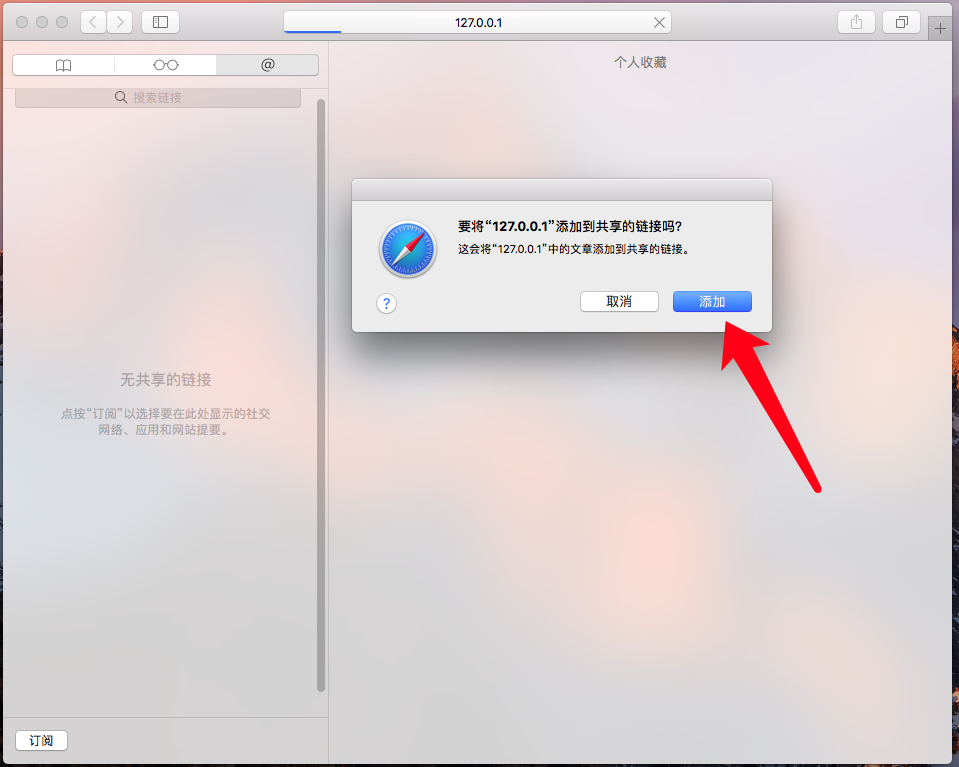
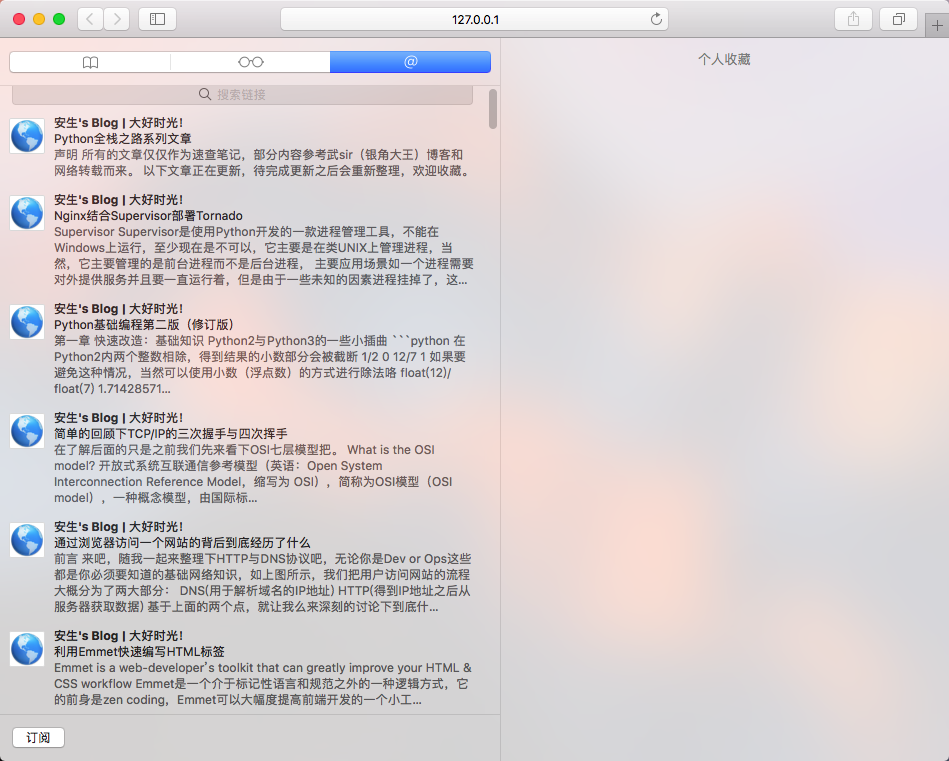
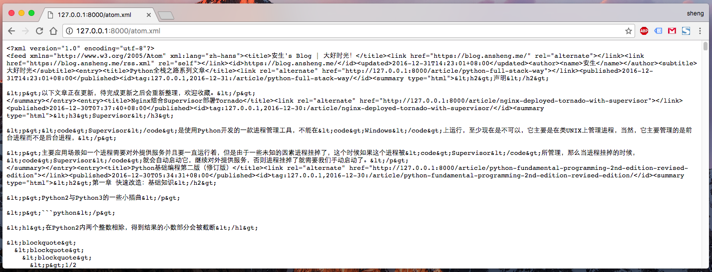
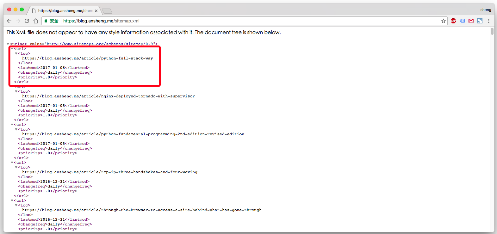

# 为你的Django站点添加订阅与站点地图

博客折腾了一段时间，总算是部署上来了，也用了段时间，感觉还可以吧，发现唯一的缺点就是没有`sitemap.xml`和`rss.xml/atom.xml`的功能，趁着下午有时间就折腾了下，这两个功能`Django`已经帮你做好了，调用就可以了。

## RSS/Atom订阅

新建一个`feeds.py`文件，内容如下：

```python
#!/use/bin/env python
# _*_ coding:utf-8 __

from django.contrib.syndication.views import Feed
from .models import Article
from django.utils.feedgenerator import Rss201rev2Feed
from django.utils.feedgenerator import Atom1Feed
from markdown2 import markdown


class ExtendedRSSFeed(Rss201rev2Feed):
    # 设置返回到浏览器头部文档类型xml
    mime_type = 'application/xml'


class RssSiteNewsFeed(Feed):
    feed_type = ExtendedRSSFeed
    author_name = "安生"
    title = "安生's Blog | 大好时光！"
    link = "https://blog.ansheng.me/"
    description = "大好时光"
    feed_url = 'https://blog.ansheng.me/rss.xml'

    def items(self):
        # 获取所有的文章，以创建时间倒叙
        return Article.objects.all().order_by('-created_time')

    def item_title(self, item):
        # 文章标题
        return item.title

    def item_description(self, item):
        # 文章的概要，因为我使用markdown语法写文章的，所以需要把它转换为HTML
        return markdown(item.abstract)

    def item_link(self, item):
        # 文章的链接地址
        return '/article/%s' % item.url

    def item_pubdate(self, item):
        # 文章创建时间
        return item.created_time

    def item_guid(self, item):
        # 返回空即可，要不然文章链接就要重复两边
        return


class AtomSiteNewsFeed(RssSiteNewsFeed):
    # ATOM功能，大致和RSS一样，只不过是两种订阅方式
    feed_type = Atom1Feed
    subtitle = RssSiteNewsFeed.description
```

配置`url.py`

```python
from django.conf.urls import url
from blog.feeds import RssSiteNewsFeed, AtomSiteNewsFeed

urlpatterns = [
    url(r'^rss\.xml$', RssSiteNewsFeed()),
    url(r'^atom\.xml$', AtomSiteNewsFeed()),
]
```

`URL`配置倒没什么好解释的，打开`Safari`浏览器，输入`http://127.0.0.1:8000/rss.xml`与`http://127.0.0.1:8000/atom.xml`将得到两种不同类型的订阅:



点击`添加`，



然后你所有的文章就被添加到订阅列表了，但是我不知道为什么`谷歌浏览器`解析出来的却不是标准的`rss.xml`文档，而显示的是字符串：


=======


点击`添加`，


然后你所有的文章就被添加到订阅列表了，但是我不知道为什么`谷歌浏览器`解析出来的却不是标准的`rss.xml`文档，而显示的是字符串：


## 站点地图

站点地图与订阅的实现方式类似，首先我们需要创建`sitemap.py`文件，内容为：

```python
#!/use/bin/env python
# _*_ coding:utf-8 __

from django.contrib.sitemaps import Sitemap
from blog.models import Article


class BlogSitemap(Sitemap):
    changefreq = "daily"  # 每天发布
    priority = 1.0  # 优先级，最大1.0
    protocol = 'https'  # 站点是http还是https类型

    def items(self):
        # 获取所有被标记为已发布的文章，必须是一个列表
        return Article.objects.filter(status=0)

    def lastmod(self, obj):
        # 创建时间
        return obj.last_modified_time

    def location(self, item):
        # URL
        return '/article/%s' % item.url
```

`URL`配置：

```python
from django.conf.urls import url
from django.contrib.sitemaps.views import sitemap
from blog.sitemap import BlogSitemap

sitemaps = {
    'static': BlogSitemap,
}
urlpatterns = [
    url(r'^sitemap\.xml$', sitemap, {'sitemaps': sitemaps}, name='django.contrib.sitemaps.views.sitemap'),
]
```

哦~，差点忘记了，你还需要在`settings.py`的`INSTALLED_APPS`中添加`django.contrib.sitemaps`APP。

```python
INSTALLED_APPS = [
    ......
    'django.contrib.sitemaps'
]
```

最后打开你的浏览器，输入`https://blog.ansheng.me/sitemap.xml`(请替换成你自己的链接)，然后就可以看到`sitemap`信息了。


=======


好了，到此结束，内容比较简单，希望能够帮到你~