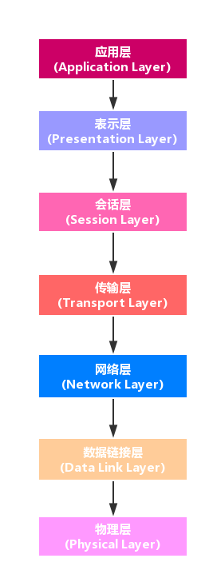
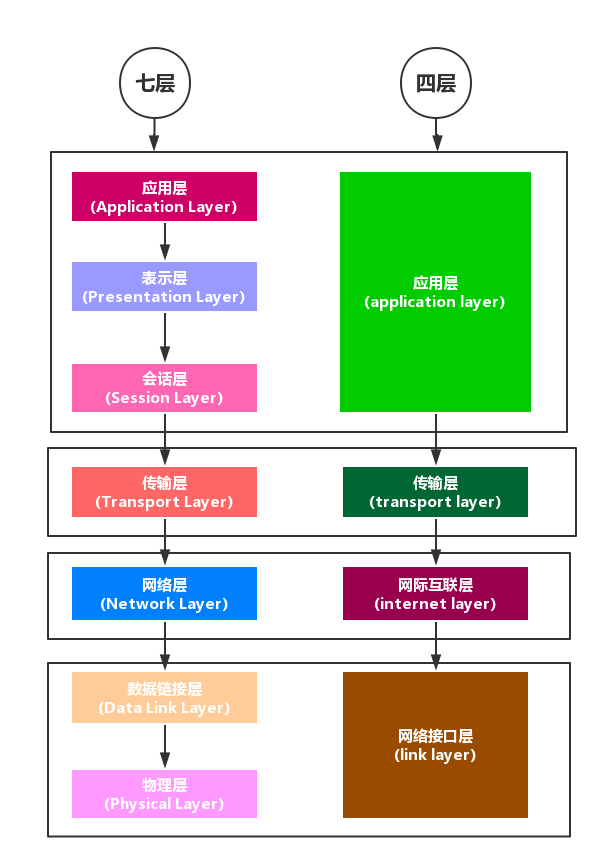
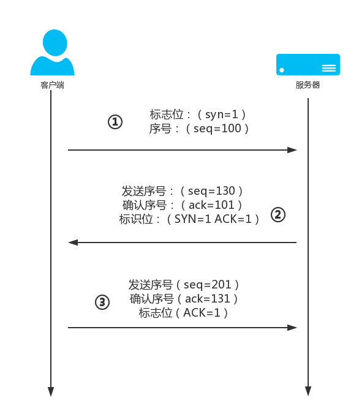

# 简单的回顾下TCP/IP的三次握手与四次挥手

在了解后面的只是之前我们先来看下OSI七层模型把。

## What is the OSI model?

开放式系统互联通信参考模型（英语：Open System Interconnection Reference Model，缩写为 OSI），简称为OSI模型（OSI model），一种概念模型，由国际标准化组织（ISO）提出，一个试图使各种计算机在世界范围内互连为网络的标准框架。定义于ISO/IEC 7498-1。

> 摘录自[维基百科](https://zh.wikipedia.org/wiki/OSI%E6%A8%A1%E5%9E%8B)

=======

第7层应用层(Application Layer)

**主要功能：** 为应用软件提供接口，使应用程序能够使用网络服务
**典型设备：** 网关
**典型协议、标准和应用：** http(80)、ftp(20/21)、smtp(25)、pop3(110)、telnet(23)、dns(53)

第6层表示层(Presentation Layer)

**主要功能：** 数据的解码和编码，数据的加密和解密，数据的压缩和解压缩
**典型设备：** 网关
**典型协议、标准和应用：** ASCLL、PICT、TIFF、JPEG、 MIDI、MPEG

第5层会话层(Session Layer)

**主要功能：** 建立、维护、管理应用程序之间的会话
**典型设备：** 网关
**典型协议、标准和应用：** RPC、SQL、NFS 、X WINDOWS、ASP

第4层传输层(Transport Layer)

**主要功能：** 负责建立端到端的链接，保证保温在端到端之间的传输
**典型设备：** 网关
**典型协议、标准和应用：** TCP、UDP、SPX

第3层网络层(Network Layer)

**主要功能：** 负责将分组数据从源端传输到目的端，网络层的主要作用就是路由和寻址
**典型设备：** 路由器
**典型协议、标准和应用：** IP、IPX、APPLETALK、ICMP

第2层数据链接层(Data Link Layer)

**主要功能：** 在不可靠的物理链路上，提供可靠的数据传输服务
**典型设备：** 交换机、网桥、网卡
**典型协议、标准和应用：** 802.2、802.3ATM、HDLC、FRAME RELAY

第1层物理层(Physical Layer)

**主要功能：** 利用传输介质为数据链路层提供物理连接，实现比特流的透明传输
**典型设备：** 集线器、中继器
**典型协议、标准和应用：** V.35、EIA/TIA-232

### TCP/IP协议族常用协议

**应用层：** TFTP，HTTP，SNMP，FTP，SMTP，DNS，Telnet 等等
**传输层：** TCP，UDP
**网络层：** IP，ICMP，OSPF，EIGRP，IGMP
**数据链路层：** SLIP，CSLIP，PPP，MTU

## What is TCP/IP?

互联网协议族（英语：Internet Protocol Suite，缩写为IPS）[1]，是一个网络通信模型，以及一整个网络传输协议家族，为互联网的基础通信架构。它常被通称为TCP/IP协议族（英语：TCP/IP Protocol Suite，或TCP/IP Protocols），简称TCP/IP[2]。因为这个协议家族的两个核心协议，包括TCP（传输控制协议）和IP（网际协议），为这个家族中最早通过的标准[3]。由于在网络通讯协议普遍采用分层的结构，当多个层次的协议共同工作时，类似计算机科学中的堆栈，因此又被称为TCP/IP协议栈（英语：TCP/IP Protocol Stack）[4][5] 。这些协议最早发源于美国国防部（缩写为DoD）的ARPA网项目，因此也被称作DoD模型（DoD Model）[6]。这个协议套组由互联网工程任务组负责维护。

TCP/IP提供点对点的链接机制，将数据应该如何封装、定址、传输、路由以及在目的地如何接收，都加以标准化。它将软件通信过程抽象化为四个抽象层，采取协议堆栈的方式，分别实现出不同通信协议。协议套组下的各种协议，依其功能不同，被分别归属到这四个层次结构之中[7][8]，常被视为是简化的七层OSI模型

> 摘录自[维基百科](https://zh.wikipedia.org/wiki/TCP/IP%E5%8D%8F%E8%AE%AE%E6%97%8F)

=======

在建立TCP连接之前需要进行三次握手，以便于链接到服务器，如果要断开服务器需要进行四次挥手，具体流程如下。

### TCP/IP三次握手

=======

1. **第一次握手：** Client将标志位syn设置为1，随机产生一个Number值seq=100，并将数据发送给Server，Client进入SYN_SENT状态，等待Server确认；
2. **第二次握手：** Server收到数据包后Client设置的标志位syn=1知道Client要求建立连接，Server将标志位syn和ack都置为1，并且发送一个确认序号ack=100+1，然后随机产生一个值seq=130，并将该数据包发送给CLient以确认连接请求，Server进入SYN_RCVD状态。
3. **第三次握手：** Client收到确认后，检查ack状态是否为100+1，ACK是否为1，如果正确则将标志位ACK置为1，ack=130+1，并将该数据包发送给Server，Server检查ack是否为130+1，ACK是否为1，如果正确则连接建立成功，Client和Server进入ESTABLISHED状态，完成三次握手，随后Client与Server之间可以开始传输数据了。

一个完整的三次握手也就是**请求---应答---再次确认**

### TCP/IP四次挥手

为什么要挥手，简单点来说就是既然建立了链接，那么肯定还要断开连接吖，连接总不能一直占用吧，这样多浪费系统该资源，下面让我们来看看四次挥手的流程。

1. **第一次挥手：** Client发送一个FIN，用来关闭Client到Server的数据传送，Client进入FIN_WAIT_1状态。
2. **第二次挥手：** Server收到FIN后，发送一个ACK给Client，确认序号为ack=100+1（与SYN相同，一个FIN占用一个序号），Server进入CLOSE_WAIT状态。
3. **第三次挥手：** Server发送一个FIN，用来关闭Server到Client的数据传送，Server进入LAST_ACK状态。
4. **第四次挥手：** Client收到FIN后，Client进入TIME_WAIT状态，接着发送一个ACK给Server，确认序号为131+1，Server进入CLOSED状态，完成四次挥手。

## Q/A(Copy过来的)

### 为什么建立连接是三次握手，而关闭连接却是四次挥手呢？

这是因为服务端在LISTEN状态下，收到建立连接请求的SYN报文后，把ACK和SYN放在一个报文里发送给客户端。而关闭连接时，当收到对方的FIN报文时，仅仅表示对方不再发送数据了但是还能接收数据，己方也未必全部数据都发送给对方了，所以己方可以立即close，也可以发送一些数据给对方后，再发送FIN报文给对方来表示同意现在关闭连接，因此，己方ACK和FIN一般都会分开发送。

### 为什么建立连接要三次握手？

**目的：** 防止已经失效的连接请求到达服务端，创建无效的连接，浪费资源。
**说明：** 当客户端发出的第一个连接请求在网络上的某个节点被滞留了（网络会存在许多不可靠的因素），过一段时间后突然又到达了服务端，服务端误以为这是一个新的建立连接的请求，于是就会向客户端发出确认包并建立连接。
实际上客户端当前并没有发出创建连接的请求，就会丢弃服务端的确认包。而服务端却创建了连接并等待客户端发送数据，浪费了相关的资源。

### SYN攻击

在三次握手过程中，服务器`发送SYN-ACK之后，收到客户端的ACK之前`的TCP连接称为半连接(half-open connect)。此时服务器处于SYN_RECV状态，当收到ACK后，服务器转入ESTABLISHED状态.

SYN攻击就是：攻击客户端在短时间内伪造大量不存在的IP地址，向服务器不断地发送SYN包，服务器回复ACK确认包，并等待客户的确认从而建立连接。由于源地址是不存在的，不会再发送ACK确认包，所以服务器需要不断的重发直至超时，这些伪造的SYN包将长时间占用未连接队列，正常的SYN请求被丢弃，目标系统运行缓慢，严重者引起网络堵塞甚至系统瘫痪。

SYN攻击是一个典型的DDOS攻击。检测SYN攻击非常的方便，当你在服务器上看到大量的半连接状态时，特别是源IP地址是随机的，基本上可以断定这是一次SYN攻击

### 为什么TIME_WAIT状态需要经过2MSL(最大报文段生存时间)才能返回到CLOSE状态？

虽然按道理，四个报文都发送完毕，我们可以直接进入CLOSE状态了，但是我们必须假象网络是不可靠的，有可以最后一个ACK丢失。所以TIME_WAIT状态就是用来重发可能丢失的ACK报文。